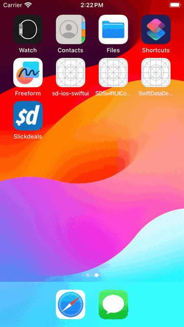

## Router

Demonstrates some Router code from the iOS PoC. This demo does not necessarily make any decisions about any architecture. It is aligned with SwiftUI features and therefore make it easier to follow. For example, routers are being injected into the view environment for use directly by the views. It is totally possible to pass the routers into the view models and use them there instead in true MVVM-C fashion.

## GIF Showcase

